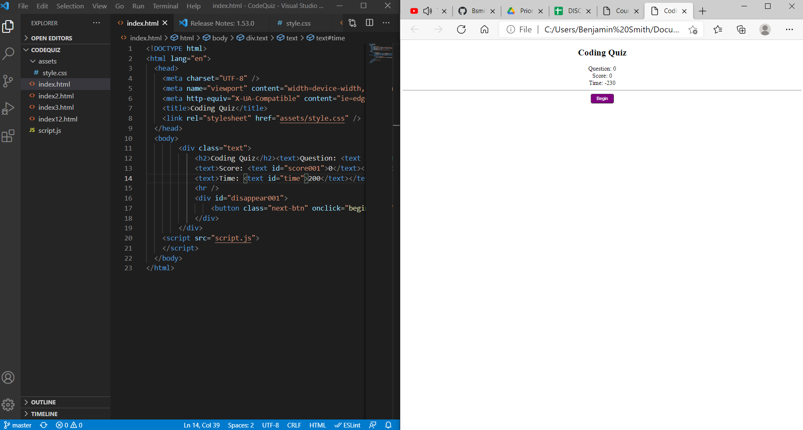

# Title: Coding Quiz
## Author (or contributors): Benjamin Smith

## Table of Contents
* [License](#license)
* [Description](#description)
* [Contributing](#contributing)
* [Usage](#usage)
* [Questions](#questions)
* [Information](#information)

### License:
#### 
Apache

### Description: 
#### 
The purpose of this project is to create a quiz with 10 questions relevant to Coding. I did this in true and false standards. At the end, you can enter your initials (the homework instructions did not specify an actual scoreboard). 

### Contributing:
#### 
Benjamin Smith

### Usage: 
#### 
The object of this app that I created is to keep answering the questions, enter your information, and see your final score. This displays the height of javascript's utility.

#### 
I also tried to change and/or simplify the time, disappear, and button elements in script.js page to see what works. I try to stay true to the other code that I have put together for other class assignments. Here is a 'time' example.

#### 
As you can see my attempts failed. This was until I..

* Broke apart each element/variable
* Split question option/answer possibilities into functions. (This is where true/false comes in handy). This is unlike what I was used to in previous assignments, interpreting separate pages categorically as HTML pages (as seen in the Coding Snippet and the justgetsworse gif). I get around this by assigning different values per function to populate the div id. Something that I first thought impossible during the first three assignments and first Project.
* I start with questions, answers, answer results to inform the test taker of their progress, and finally use the script.js page to assign a sequence. After this, there is the end page.
* The lesson I learned: Easy is Better! I have never valued this until encountering this assignment. 

#### 
Here is a final gif of the successful app

### Information:
#### 
I am better contacted by email.

* [Github profile](https://github.com/Bsmi3275)

* Email: bbsmith1107@email.campbell.edu

#### 
This project was by far the hardest I have ever completed and has taken me months to fully master. The first attempt is shown sideways on the following image.
